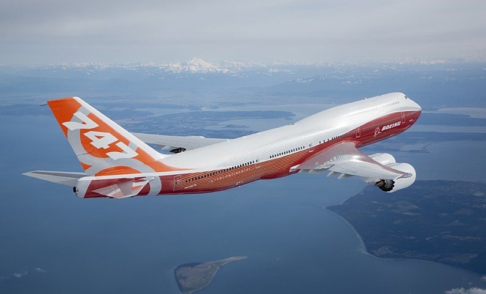

## คำอธิบายโปรเจค

* โปรเจคนี้มีจุดประสงค์เพื่อการศึกษาในการวิเคราะห์ข้อมูลการเกิดอุบัติเหตุของเครื่องบินแต่ละชนิด เพื่อหาสถิติ   การเกิดอุบัติเหตุโดยวิเคราะห์จากปัจจัยต่างๆ อาทิ สภาพอากาศ ปัจจัยทางกายภาพ ประเภทของเครื่องบิน และแสดงสถิติความเสียหายของอุบัติเหตุว่ามากน้อยเพียงใด โดยคำนวณจากข้อมูลกว่า 3000 ครั้งโดยประมาณ   
ตั้งแต่ปี พ.ศ.2513 (ค.ศ. 1970) จนถึงปี พ.ศ.2559 (ค.ศ. 2016) รวมระยะเวลากว่า 46 ปี โดยเลือกใช้ภาษา   
python ในการเขียนโปรแกรมคำนวณ

## ใช้ข้อมูลจากไหน ?
  ข้อมูลจาก  
  * https://www.kaggle.com/saurograndi/airplane-crashes-since-1908
  * http://www.planecrashinfo.com/  
รูปแบบข้อมูล : ไฟล์ข้อมูลนามสกุล .csv ซึ่งประกอบด้วย  
  * Date : วันที่เกิด
  * Time : เวลาที่เกิด
  * Location : สถานที่เกิด ระบุเป็นเมืองและประเทศ
  * Type : โมเดลหรือรุ่นของตัวเครื่องบิน ระบุทั้งตระกูลและรุ่นย่อย
  * Flight : หมายเลขเที่ยวบิน
  * Aboard : จำนวนผู้โดยสารทั้งหมด รวมทั้งลูกเรือ
  * Fatalities : จำนวนผู้เสียชีวิตที่โดยสารมาพร้อมกับเที่ยวบิน
  * Ground : จำนวนผู้เสียชีวิตบนภาคพื้น
  * Summary : สรุปข้อมูลอุบัติเหตุ เป็นข้อความที่กล่าวถึงชนิดของเครื่องบิน และเหตุที่ก่อให้เกิดอุบัติเหตุ

หมายเหตุ
 * จาก Dataset เลือกใช้ช่วงเวลา 1970 เป็นต้นมาเพราะในก่อนหน้านี้มีสงครามโลกครั้งที่ 1 และ 2 ซึ่งอาจเกิดความคลาดเคลื่อนของข้อมูลได้สูงมาก เนื่องด้วยเครื่องบินในยุคนั้นโดยส่วนมากผลิตเพื่อใช้ในสงครามมากกว่าที่จะใช้ขนส่ง  และตั้งแต่ปี 1970 เป็นต้นมา เครื่องบินที่ใช้เครื่องยนต์ไอพ่นเริ่มได้รับการพัฒนาขึ้น  ซึ่งก่อนหน้านี้จะใช้เป็นใบพัดทั้งหมด  

### สถิติการเกิดอุบัติเหตุโดยเรียงตามปี
<embed type="image/svg+xml" src="https://cdn.rawgit.com/158Alfetta/dfb7247e061c3d71e8a964758b1e099a/raw/2800242367f1f13464e393e6e9fb942afd9ce482/(c)bar_vertical_year.svg"  align="center" />  
  
#### อธิบาย
  * จากกราฟพบว่าแนวโน้มของการเกิดอุบัติเหตุนั้นน้อยลง สังเกตได้จากในช่วงแรกๆ ไม่มีปีใดเลยที่มีอุบัติเหตุน้อยกว่า 60 ครั้งต่อปี หลังปี 2004 จึงเริ่มลดลงมา
  * หากมองเป็นทศวรรษ จะพบว่าในช่วง 70s จะเยอะที่สุด ทศวรรษถัดไปในปี 1980-1987 มีเหตุน้อยกว่าช่วงทศวรรษแรก และเริ่มเยอะขึ้นอีกครั้งในปี 1988-1989
  ช่วง 90s ภาพรวมเยอะกว่าทศวรรษที่แล้ว และหลัง ปี 2000 อุบัติเหตุมีแนวโน้มลดน้อยลง เนื่องมาจากเทคโนโลยีการบินที่มีความปลอดภัยมากขึ้น เพราะเครื่องบนในช่วงแรกที่ให้บริการในยุคแรกนั้นเริ่มปลดระวางแล้ว และเปลี่ยนเครื่องใหม่ (โดยปกติเครื่องบินจะทำการบินประมาณ 20-30 ปี ถึงจะปลดระวาง ในระหว่างนั้นก็บำรุงรักษาตามมาตรฐาน) ซึ่งพอดีกับเวลาที่เครื่องบินไอพ่นในยุคแรกเริ่มปลด
  * ปีที่เกิดเหตุเยอะที่สุดคือ 1972 และรองลงมาคือ 1989  
#### เกิดอะไรขึ้นในปี 1972 ?
  * จากการค้นหาข้อมูลพบว่าในปี 1972 นั้น ในปีดังกล่าวถือว่าเป็นปีที่ก้าวกระโดดของเครื่องบินแบบโดยสาร เพราะมีหลายสายการบินเริ่มเปิดให้บริการ อาทิ สารการบิน Aeroflot
  และอยู่ในช่วงปลายของสงครามเวียดนาม (จบลงในปี 1975) ซึ่งทำการรบอย่างดุเดือด เครื่องบินในยุคนี้เริ่มเปลี่ยนเป็นไอพ่น 

#### กราฟเส้นแสดงอัตราผู้เสียชัวิต โดยเรียงตามปี 
_____________________________________________________________________________________________________

<embed type="image/svg+xml" src="https://cdn.rawgit.com/158Alfetta/807efd58fe93168be36663a1addb8c97/raw/ba3a41ec06343c3772da84a4d0c079b1eaedce3b/(c)fatal_line.svg"  align="center" />  

#### อธิบาย
  * ทั้งแผนภูมิสถิติที่เกิดอุบัติเหตุและกราฟเส้นของผู้เสียชีวิตสอดคล้องกัน กล่าวคือ เกิดเหตุหลายครั้ง ผู้เสียชีวิตก็มีจำนวนที่เยอะ ในกราฟนี้ปี 1972 ก็มีจำนวนผู้เสียชีวิตเยอะที่สุด
  สอดคล้องกับแผนภูมิด้านบน
  * พบข้อสังเกตุในปี 2013 และปี 2014 ที่มีอุบัติเหตุเท่ากันคือ 33 ครั้ง แต่ผู้เสียชีวิตของปี 2013 คือ 341 ราย ในขณะที่ปี 2014 มีสูงถึง 1189 ราย
<embed type="image/svg+xml" src="https://cdn.rawgit.com/158Alfetta/077949c34279af865bf36dbd62a4d62c/raw/125d6e4a469c3d296290f3a0633c3683d3d95b56/operate2_line.svg"  align="center" />  
  มองลึกไปถึงประเภทเครื่องบิน ในปี 2013 และปี 2014 มีเครื่องบินโดยสารตกเท่ากันคือ 26 ลำ และเครื่ิองบินประเภทอื่นไม่แตกต่างกันมาก 
  
  * แสดงให้เหตุว่า ในข้อสันนิษฐานแรกนั้น ไม่เป็นเสมอไป เพราะ

### สถิติแสดงการเกิดอุบัติเหตุที่ส่งผลกระทบต่อผู้คนภาคพื้น
* แสดงเหตุการณ์ที่มีผู้เสียชีวิตที่อยู่บนภาคพื้น (Ground) เพราะโดยปกติแล้วเครื่องบินโดยส่วนใหญ่จะเกิดอุบัติเหตุบริเวณที่ไม่ใช่เขตเมือง หรือบริเวณจุดที่มีผู้คนอาศัยอยู่ เนื่องด้วยนักบินถูกฝึกให้หลีกเลี่ยงการเกิดอุบัติเหตุในลักษณะดังกล่าว เพื่อให้เกิดความเสียหายน้อยที่สุด ถ้าเหตุการณ์ใดนั้นมีผู้เสียชีวิตภาคพื้นมาก อาจสันนิษฐานได้ว่าเหตุการณ์นั้น อาจตกในบริเวณที่มีผู้คนอาศัยอยู่ หรือเขตเมือง

โดยแผนภูมินี้จะแสดงสถิติผู้เสียชีวิตที่อยู่ภาคพื้น โดยเรียงตามจำนวนของผู้เสียชีวิต(ไม่รวมบนเครื่อง)   จะมาวิเคราะห์กันว่า ในเหตุการณ์ส่วนใหญ่นั้น มีอะไรเกิดขึ้น ที่ทำให้เครืองบินลำนั้น

<embed type="image/svg+xml" src="https://cdn.rawgit.com/158Alfetta/52179aa4041b87355c2c10cc8fc39a36/raw/f0bbfde956a5fbaa612e335e8e409a99521953e9/(c)ground.svg
" />  

* Description : วิเคราะห์กราฟแรก  

<embed type="image/svg+xml" src="https://cdn.rawgit.com/158Alfetta/030aea455f9f7519aca745a50ab5c096/raw/7d2407adc2cfed38eef27a8e5a18b642afb5ae42/Ground_keyword.svg" />  

* Description : ยังวิเคราะห์ไม่ได้ จะเพิ่มอีกราฟ เพื่อมาวิเคราะห์  

### แผนที่แสดงอุบัติเหตุที่เกิดขึ้นในประเทศต่างๆ แสดงเป็นจำนวนครั้ง
* เพื่อหาว่าอุบัติเหตุโดยส่วนใหญ่มักจะเกิดขึ้นที่ไหน และทวีปไหนเยอะ

<embed type="image/svg+xml" src="https://cdn.rawgit.com/158Alfetta/941b94cbd93b85cf6bc9a25f2569d056/raw/9703783517fdcb2f822cf73d726fa04296543383/maps2.svg"  />  

* Description : บลาๆๆๆๆๆๆๆ

### แล้วเครื่องบินแบบไหนเกิดอุบัติเหตุบ่อย ?
* จากข้อมูลที่ได้มา มีการบันทึกถึงรุ่นของเครื่องบินด้วย แต่หากจะอธิบายว่าเครื่องบินรุ่นนี้เกิดอุบัติเหตุบ่ิยนั้น ก็อาจจะดูไม่เหมาะสมสักเท่าไร เพราะว่าหากเครื่องบินรุ่นนี้มีการขายเยอะ หมายความว่าการเกิดอุบัติเหตุก็สูงขึ้นได้ด้วยเช่นกัน ดังนั้น จึงต้องมาเทียบกับยอดการผลิตของเครื่องบิน
* เนื่องจากมีรุ่นเครื่องบินมากมาย บางรุ่นอาจผลิตน้อยมาก และเกิดอุบัติเหตุน้อย จึงยกข้อมูลมาเพียง 10 อันดับแรก

#### แผนภูมิแที่ 1 แสดงอัตราการเกิดอุบัติเหตุของรุ่นเครื่องบิน 10 อันดับแรก โดยเรียงตามจำนวนครั้งที่เกิด
<embed type="image/svg+xml" src="https://cdn.rawgit.com/158Alfetta/cfceaff354c9cc332454c47847d208fd/raw/039fe36b6e49cb2fd5d9df67ddd4431ca5c14b2f/(c)model.svg"  />  
_____________________________________________________________________________________________________

#### แผนภูมิแสดงอัตราร้อยละ เมื่อนำข้อมูลจากตารางที่ 1 มาเทียบกับยอดการผลิตของเครื่องบินแต่ละรุ่น  

<embed type="image/svg+xml" src="https://cdn.rawgit.com/158Alfetta/f19a57c622807451acd8babcdfd38806/raw/9e5d6c2509f4e1b3847442c98d69a06a71f23922/(c)Percent_model.svg" />  

* Description :

### แผนภูมิแสดงสถิติการเกิดอุบัติเหตุโดยแบ่งตามประเภทของเครื่องบิน
* แผนภูมินี้จะแบ่งประเภทการเกิดอุบัติเหตุตามประเภทเครื่องบิน  ว่าเป็นเครื่องบินทหาร เครื่องบินโดยสาร หรือเครื่องบินส่วนบุคคล

<embed type="image/svg+xml" src="https://cdn.rawgit.com/158Alfetta/ff226d83ec8b411c0147f60f75f03936/raw/25c9975124e65f55d2f8db4d2a8f66ab0685bb05/Operation_categories_2.svg" />  

* Description :

## ปัจจัยที่ส่งผลต่อการเกิดอุบัติเหตุ  

* Detail :

### แผนภูมิแสดงสถานะของเครื่องบินเมื่อเกิดอุบัติเหตุ
* วิเคราะห์ว่าโดยส่วนใหญ่แล้วเครื่องบินจะเกิดอุบัติเหตุเมื่อใด โดยมี 3 สถานะ คือ  
1.ขณะนำเครื่องขึ้นบิน (Take off)  
2.ขณะทำการบิน (On-Flight)  
3.ขณะนำเครื่องลงสู่ท่าอากาศยาน (Landing)

<embed type="image/svg+xml" src="https://cdn.rawgit.com/158Alfetta/03139e0c8111817079c0f4fbe2174e14/raw/509f11dfeeee7552500865fe492e9be62393e2ae/status_bar_chart.svg" />

* Description :

### แผนภูมิแท่งแสดงจำนวนคำที่พบในข้อมูลอุบัติเหตุ ระหว่าง Landing กับ Takeoff

### แผนภูมิแสดงประเภทของหนึ่งในสาเหตุที่ส่งผลต่อการเกิดอุบัติเหตุ
* โดยวิเคราะห์จาก บลาๆๆๆๆๆๆๆๆๆๆๆๆๆๆๆๆๆๆ

<embed type="image/svg+xml" src="https://cdn.rawgit.com/158Alfetta/708afa3675fc300b01381d1900af11e4/raw/847acc4b95dbf2e1d10f7dc5c548a8f8d93ac434/(C)bar_class.svg" />

* Description :

#### แผนภูมิอุบัติเหตุที่เกิดจากสภาอากาศ(Weather) โดยจำแนกตามสภาวะสภาพอากาศ  
* โดยวิเคราะห์จากกกกกกกกก

<embed type="image/svg+xml" src="https://cdn.rawgit.com/158Alfetta/3ef9624e7ea93da492d085fa3cc52189/raw/1e8c5cb7cb6012b23dddb4a677d00dcdb1fd8229/(c)weather_chart.svg" />  
* Description :  

## แผนที่โลกแสดงบริเวณที่เกิดอุบัติเหตุจากการถูกโจมตี
* โดยวิเคราะห์จากกกกกกกก

<embed type="image/svg+xml" src="https://cdn.rawgit.com/158Alfetta/ea23d5686054178c1052882806d93b4b/raw/63a4e5e327f5f61fd42460ac61c492cbb0d4261b/(c)maps_atk.svg" />  

<embed type="image/svg+xml" src="" weight='1024' height="768" />
